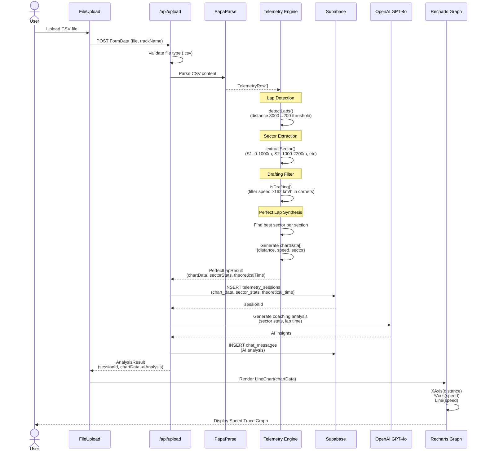
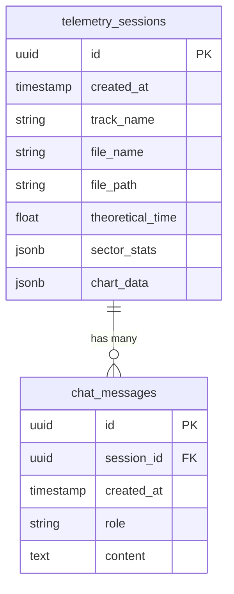

# Project Prometheus

A Next.js 14 racing telemetry analysis application for the Toyota GR Cup that synthesizes a "Perfect Lap" by combining the best sectors from telemetry data and provides AI-powered coaching insights with an interactive chat interface.

## Features

- **File Upload**: Drag-and-drop CSV file upload interface (no need to place files in public/data/)
- **Perfect Lap Synthesis**: Analyzes telemetry CSV data to find the fastest sector times and combines them into a theoretical best lap
- **Smart Filtering**: Automatically filters out laps affected by drafting (speed >162 km/h in corner sectors)
- **AI Coaching Chat**: Interactive chat interface powered by OpenAI GPT-4o for personalized coaching
- **Session Persistence**: All telemetry sessions and chat history stored in Supabase
- **Real-time Visualization**: Interactive charts showing speed vs distance for the perfect lap
- **Racing Aesthetic**: Dark theme with emerald green accents designed for racing data
- **Three-Tab Interface**: Upload, Analysis, and Coach tabs for streamlined workflow

## Tech Stack

- **Framework**: Next.js 14 (App Router, TypeScript)
- **Database**: Supabase (PostgreSQL)
- **Styling**: Tailwind CSS with custom racing theme
- **Data Processing**: PapaParse for CSV parsing
- **Visualization**: Recharts
- **AI**: OpenAI GPT-4o
- **UI Components**: shadcn/ui

## Setup

1. **Install Dependencies**
   ```bash
   npm install
   ```

2. **Configure Environment Variables**

   The `.env` file should contain:
   ```
   NEXT_PUBLIC_SUPABASE_URL=your_supabase_url
   NEXT_PUBLIC_SUPABASE_ANON_KEY=your_supabase_anon_key
   OPENAI_API_KEY=sk-your-actual-api-key-here
   ```

3. **Database Setup**

   The database schema is automatically created via Supabase migrations. Tables include:
   - `telemetry_sessions`: Stores uploaded telemetry analysis results
   - `chat_messages`: Stores coaching chat history

4. **CSV File Format**

   Upload CSV files with these required columns:
   - `timestamp`: Time on ECU
   - `Laptrigger_lapdist_dls`: Distance from start/finish in meters
   - `Speed`: Vehicle speed in km/h
   - `Steering_Angle`: Steering input
   - `pbrake_f`: Front brake pressure
   - `aps`: Accelerator pedal position

## COTA Sector Definitions

The application uses these hardcoded sectors for Circuit of the Americas:

- **S1**: 0m - 1000m
- **S2**: 1000m - 2200m
- **S3**: 2200m - 3500m
- **S4**: 3500m - End

## Usage

1. **Start Development Server**
   ```bash
   npm run dev
   ```

2. **Open Application**

   Navigate to `http://localhost:3000`

3. **Upload Tab**
   - Drag and drop your CSV telemetry file or click "Browse Files"
   - Click "Analyze & Synthesize" to process the data

4. **Analysis Tab**
   - View your theoretical best lap time
   - See sector-by-sector breakdown with time gains
   - Explore the speed vs distance chart
   - Read the initial AI analysis

5. **Coach Tab**
   - Chat with the AI race engineer about your performance
   - Ask specific questions about braking points, corner speeds, or sector improvements
   - Get personalized coaching based on your actual telemetry data
   - All conversations are saved to the session

## How It Works

1. **File Upload**: CSV files are uploaded via the browser and processed server-side

2. **Lap Detection**: The system detects lap boundaries by monitoring when `Laptrigger_lapdist_dls` drops from >3000m to <200m (works around broken lap counter)

3. **Sector Analysis**: Each lap is divided into predefined sectors, and the system calculates the time for each sector

4. **Drafting Filter**: Sectors where max speed exceeds 162 km/h in corners are filtered out as they likely benefited from drafting

5. **Perfect Lap Synthesis**: The fastest valid sector from each section is combined to create a theoretical best lap

6. **Session Storage**: All analysis results are stored in Supabase for future reference

7. **AI Analysis**: OpenAI analyzes the sector data and provides initial coaching insights

8. **Interactive Coaching**: Continue the conversation with the AI, asking follow-up questions. The AI has full context of your telemetry data and provides specific, actionable advice

## Architecture

### System Overview

```mermaid
graph TB
    subgraph Client["Client (Browser)"]
        UI[React UI Components]
        FileUpload[File Upload Component]
        Chart[Recharts Visualization]
        Chat[Chat Interface]
    end

    subgraph Server["Next.js Server"]
        UploadAPI["/api/upload"]
        ChatAPI["/api/chat"]
        HistoryAPI["/api/chat/history"]
        TelemetryEngine["Telemetry Engine<br/>(CSV Processing)"]
    end

    subgraph External["External Services"]
        Supabase[(Supabase PostgreSQL)]
        OpenAI[OpenAI GPT-4o]
    end

    FileUpload -->|CSV File| UploadAPI
    UploadAPI --> TelemetryEngine
    TelemetryEngine -->|Parse & Analyze| TelemetryEngine
    UploadAPI -->|Store Session| Supabase
    UploadAPI -->|Generate Analysis| OpenAI
    UploadAPI -->|chartData, stats| Chart

    Chat -->|User Message| ChatAPI
    ChatAPI -->|Query Context| Supabase
    ChatAPI -->|Generate Response| OpenAI
    ChatAPI -->|Store Message| Supabase
    ChatAPI -->|Response| Chat

    UI -->|Load History| HistoryAPI
    HistoryAPI -->|Fetch Messages| Supabase
    HistoryAPI -->|Messages| UI

    style Client fill:#1a1a2e
    style Server fill:#16213e
    style External fill:#0f3460
```



### Data Flow: CSV Upload to Graph Display



### Component Architecture

```mermaid
graph TD
    subgraph App["app/page.tsx - Main Application"]
        State[State Management]
        UploadSection[Upload Section]
        ResultSection[Results Section]
    end

    subgraph Components["React Components"]
        Navigation[Navigation]
        FileUploadComp[FileUpload Component]
        SectorCards[Sector Stats Cards]
        SpeedChart[Speed Trace Chart<br/>Recharts]
        StreamingAnalysis[StreamingAnalysis<br/>AI Insights]
        ChatInterface[ChatInterface<br/>Interactive Q&A]
    end

    subgraph UI["UI Components (shadcn/ui)"]
        Button[Button]
        Card[Card]
        Alert[Alert]
    end

    App --> Navigation
    UploadSection --> FileUploadComp
    UploadSection --> Button
    UploadSection --> Alert

    ResultSection --> SectorCards
    ResultSection --> SpeedChart
    ResultSection --> StreamingAnalysis
    ResultSection --> ChatInterface

    FileUploadComp --> Card
    SectorCards --> Card
    SpeedChart --> Card
    StreamingAnalysis --> Card
    ChatInterface --> Card

    State -.->|selectedFile| FileUploadComp
    State -.->|result| ResultSection
    State -.->|loading| Button
    State -.->|error| Alert

    style App fill:#2d4263
    style Components fill:#1a1a2e
    style UI fill:#0f3460
```



### Database Schema



### API Routes Data Flow

```mermaid
graph LR
    subgraph Upload["/api/upload"]
        U1[Receive FormData]
        U2[Validate CSV]
        U3[Parse & Analyze]
        U4[Store Session]
        U5[Generate AI Analysis]
        U6[Return Results]

        U1 --> U2 --> U3 --> U4 --> U5 --> U6
    end

    subgraph Chat["/api/chat"]
        C1[Receive Message]
        C2[Fetch Session Context]
        C3[Build AI Prompt]
        C4[Stream Response]
        C5[Store Message]

        C1 --> C2 --> C3 --> C4 --> C5
    end

    subgraph History["/api/chat/history"]
        H1[Receive Session ID]
        H2[Query Messages]
        H3[Return History]

        H1 --> H2 --> H3
    end

    Upload -.->|sessionId| Chat
    Upload -.->|sessionId| History

    style Upload fill:#16213e
    style Chat fill:#1a1a2e
    style History fill:#0f3460
```



### Telemetry Processing Pipeline

```mermaid
flowchart TD
    Start([CSV File]) --> Parse[Parse CSV with PapaParse]
    Parse --> Validate{Valid Data?}

    Validate -->|No| Error1[Throw Error:<br/>No telemetry data]
    Validate -->|Yes| DetectLaps[Detect Lap Boundaries<br/>Distance: 3000m → 200m]

    DetectLaps --> HasLaps{Laps Found?}
    HasLaps -->|No| Error2[Throw Error:<br/>No valid laps detected]
    HasLaps -->|Yes| ExtractSectors[Extract Sectors from Each Lap<br/>S1, S2, S3, S4]

    ExtractSectors --> FilterDrafting{Check Drafting<br/>Speed > 162 km/h<br/>in corners?}
    FilterDrafting -->|Yes| Skip[Skip Sector]
    FilterDrafting -->|No| Compare[Compare Sector Times]

    Skip --> NextSector{More Sectors?}
    Compare --> FindBest[Track Best Sector Time]
    FindBest --> NextSector

    NextSector -->|Yes| ExtractSectors
    NextSector -->|No| HasBestSectors{Found Valid<br/>Sectors?}

    HasBestSectors -->|No| Error3[Throw Error:<br/>No valid sectors]
    HasBestSectors -->|Yes| Calculate[Calculate Theoretical Time<br/>Sum of Best Sectors]

    Calculate --> GenerateChart[Generate Chart Data<br/>{distance, speed, sector}[]]
    GenerateChart --> GenerateStats[Generate Sector Stats<br/>{time, lap, gain, avgSpeed}[]]

    GenerateStats --> Return([Return PerfectLapResult])

    style Start fill:#4ecca3
    style Return fill:#4ecca3
    style Error1 fill:#ff6b6b
    style Error2 fill:#ff6b6b
    style Error3 fill:#ff6b6b
    style FilterDrafting fill:#ffd93d
    style HasLaps fill:#ffd93d
    style HasBestSectors fill:#ffd93d
    style Validate fill:#ffd93d
```

## Project Structure

```
├── app/
│   ├── api/
│   │   ├── analyze/route.ts         # Legacy API endpoint
│   │   ├── upload/route.ts          # File upload and analysis
│   │   └── chat/
│   │       ├── route.ts             # Chat messaging
│   │       └── history/route.ts     # Chat history retrieval
│   ├── globals.css                  # Racing theme styles
│   ├── layout.tsx                   # Root layout
│   └── page.tsx                     # Main dashboard with tabs
├── components/
│   ├── FileUpload.tsx               # Drag-and-drop file upload
│   └── ChatInterface.tsx            # AI coaching chat UI
├── lib/
│   ├── telemetry-engine.ts          # File-based processing (legacy)
│   ├── telemetry-engine-upload.ts   # Upload-based processing
│   └── supabase.ts                  # Supabase client
└── types/
    └── telemetry.ts                 # TypeScript interfaces
```

## Build

```bash
npm run build
```

## Example Coaching Questions

- "Where can I find the most time?"
- "How's my braking in Sector 2?"
- "What's the ideal speed through Turn 1?"
- "Compare my corner speeds across sectors"
- "Where should I focus my practice?"

## Future Enhancements

- Support for multiple tracks with configurable sector definitions
- Session browser to review past analyses
- Historical lap comparison across sessions
- Multi-driver analysis and comparison
- Advanced filtering algorithms (tire degradation, fuel load)
- Lap-by-lap progression charts
- Export functionality for reports and session data
- Real-time telemetry streaming
- Video overlay with telemetry data
